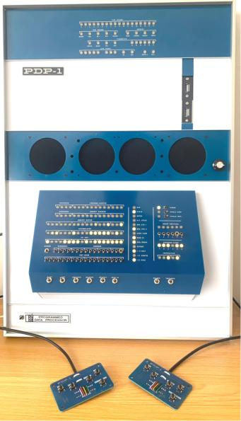

<!--

  

-->

  

<h3>Retro Computing • Robotics • Quantum Computing • Electronics</h3>

  
  
  

<em>Past - aviation domain; Present - robotics, retro computing; Future - teaching, learning, volunteering</em>

---

## Current Projects:

I use this space to capture what I've built, what I'm tinkering with now, and ideas I'm exploring next. From retro computing to robotics, this page is my running log of my projects.

---

<h2 align="center">🤖 MakersPet Robot Workshop</h2>

  

 

I currently teach a hands-on robotics workshop at [make717](https://make717.org) using the [MakersPet Robot](https://makerspet.com) — a beginner-friendly ROS 2-based platform perfect for learning autonomous navigation, sensors, and robot programming.

**What we cover in the workshop:**
- 🔧 Hardware overview
- 📡 Sensor explanation (LiDAR, IMU, encoders)
- 🗺️ Autonomous navigation with ROS 2 and Nav2
- 💻 Implementing your first robot behaviors

&nbsp;&nbsp;

<h2 align="center">PiPD-1</h2>

  

A soon to be started project is the [PiDP-1 by Obsolescence Quaranteed](https://obsolescence.dev/pdp1.html).  I already have the PiDP-8, PiDP-10, and PiDP-11.  The PiDP-1 holds a special place in the history of computing.  

The PDP-1 was DEC’s first computer and one of the most important early interactive systems, introduced in 1959. It became famous for helping launch hacker culture and for hosting Spacewar!, one of the first video games.

### What it was
PDP stands for “Programmed Data Processor,” a naming choice DEC used instead of “computer.” The PDP-1 was a 18-bit machine with a 4,096-word main memory in its standard configuration.

### Why it matters
It was the first commercial computer designed around user interaction rather than batch processing, which made it a major step toward modern interactive computing. It also supported early time-sharing, text editing, debugging, graphics, and music programs.

### Cultural impact
The PDP-1 is best known today as the machine on which Spacewar! was created in 1962, making it a landmark in video game history. It also played a central role in the early MIT/BBN hacker scene. (Wikipedia)

&nbsp;&nbsp;

<h2 align="center">Ben Eater 6502</h2>

  

&nbsp;&nbsp;

