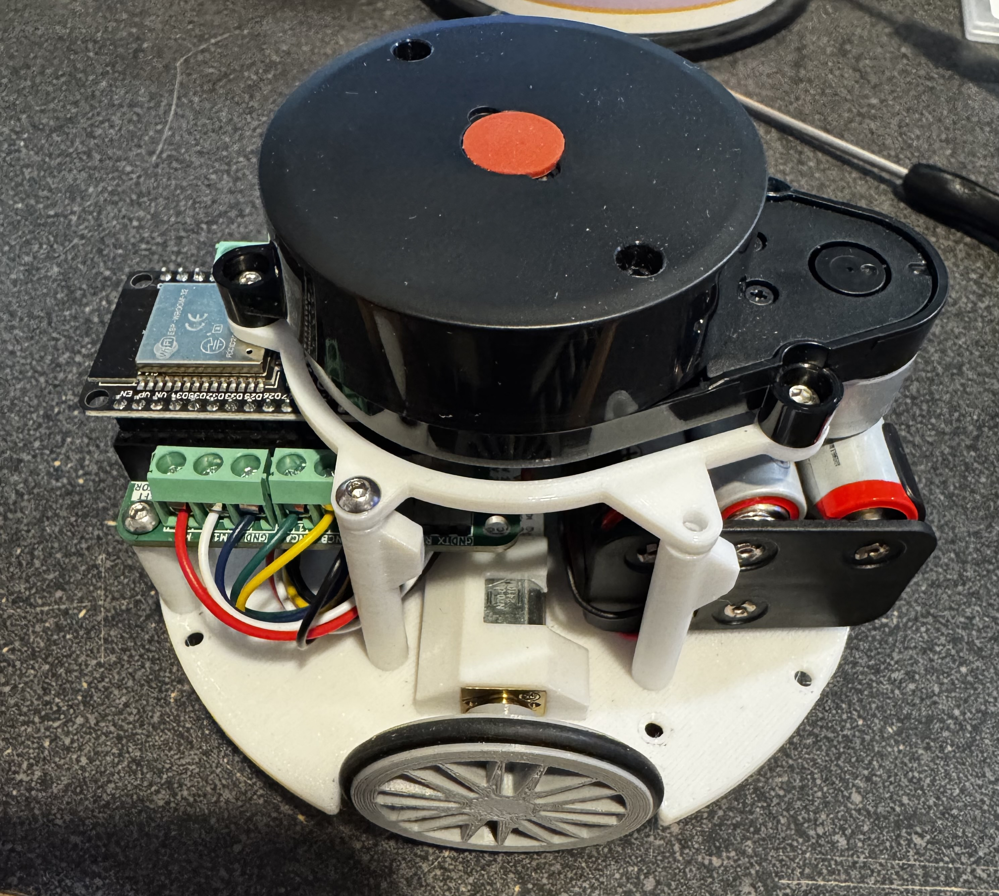

<h3>Retro Computing • Robotics • Quantum Curiosity</h3>

  
  
  

<em>Past ATC systems, present makerspace robots, future quantum experiments — this space is my running log of projects in motion.</em>

---

## Current Projects:

I use this space to capture what I've built, what I'm tinkering with now, and ideas I'm exploring next. From retro computing to robotics, this page is my running log of projects in motion.

---

<h2 align="center">🤖 MakersPet Robot Workshop</h2>

  

 

I currently teach a hands-on robotics workshop at [make717](https://make717.org) using the [MakersPet Robot](https://makerspet.com) — a beginner-friendly ROS 2-based platform perfect for learning autonomous navigation, sensors, and robot programming.

**What we cover in the workshop:**
- 🔧 Robot assembly and hardware overview
- 📡 Sensor integration (LiDAR, IMU, encoders)
- 🗺️ Autonomous navigation with ROS 2 and Nav2
- 💻 Writing your first robot behaviors

